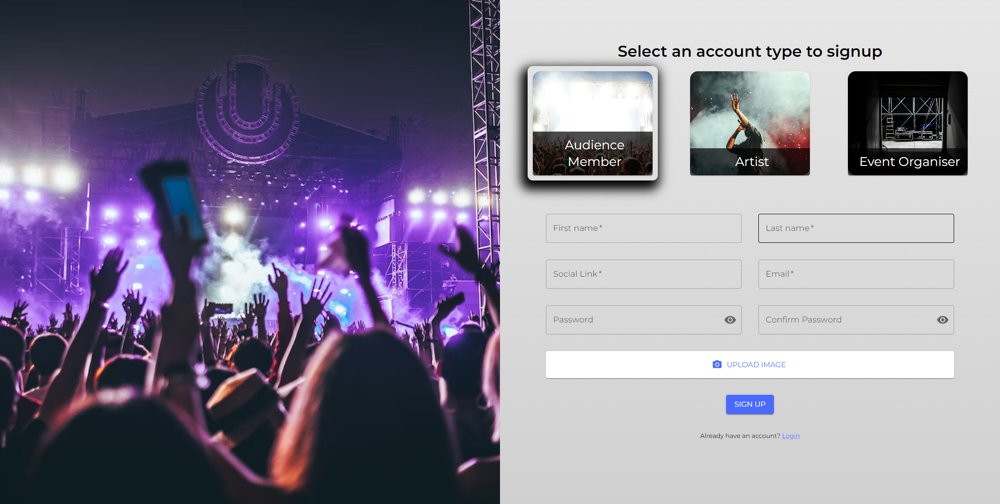
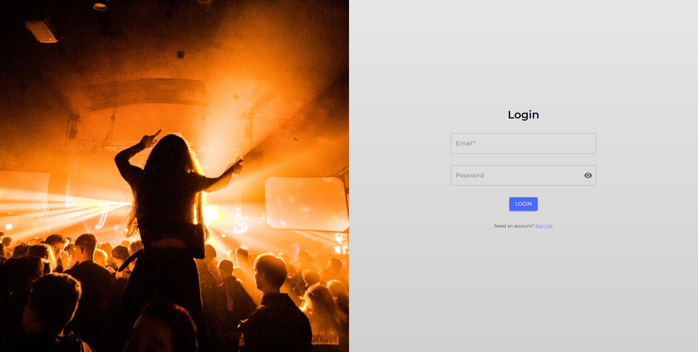
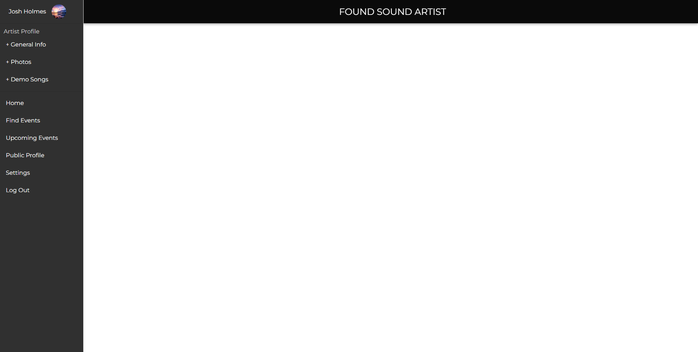
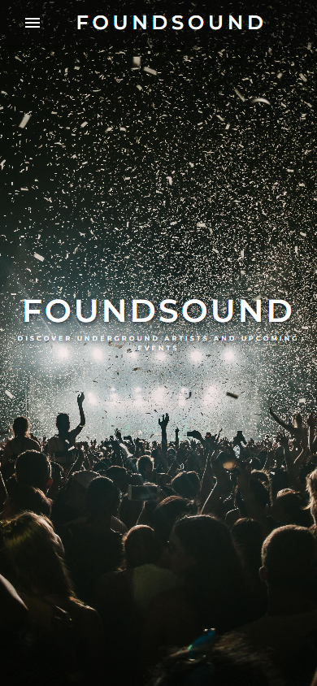

# FoundSound

# About FoundSound

The FoundSound app gives artists, event organisers and audience members the ability to interact with one another in a way that hasn't been done before!

FoundSound gives artists the ability to respond to ads posted by event organisers.

Event organisers can post ads where artists can respond to get them to play a gig at their event.

Keep reading to find out more about our application.

# Project Link

[Heroku Link](https://shielded-springs-74302.herokuapp.com/)

## Getting Started

To run the application locally you will first need to clone both the client and server repositories.

To access the server repository click [here](https://github.com/glowingmanagement/foundsound-server) and follow the steps to get started with the server.

```
git@github.com:glowingmanagement/foundsound-client.git
cd foundsound-client
mpn i
```

## About The Project

FoundSound is a React.js application, using GraphQL queries and mutations to connect with our Apollo server and MongoDB database.

## Key Features

## Screenshots

### Desktop View


### Signup Page



### Login Page



### Artist Dashboard



### Mobile View



# Contributors

- Josh Holmes - [GitHub Link](https://github.com/glowingmanagement) - [LinkedIn](https://www.linkedin.com/in/joshholmes22/) - [Portfolio](https://glowingmanagement.github.io/my-portfolio/)
- Amirtha Muthirulandi - [GitHub Link](https://github.com/amirtha-coder) - [LinkedIn](https://www.linkedin.com/in/a-m-9518071ab/) - [Portfolio](https://amirtha-coder.github.io/react-portfolio/)
- Zahra Haji - [GitHub Link](https://github.com/zahrahaji10) - [LinkedIn](https://www.linkedin.com/in/zahra-haji-3baab1191/) - [Portfolio](https://zahrahaji10.github.io/personal-portfolio/)
- Sophia Wall - [GitHub Link](https://github.com/sophia4422) - [LinkedIn](https://www.linkedin.com/in/sophia-wall/) - [Portfolio](https://sophia4422.github.io/my-react-portfolio/)
- Rukhsana Wasiak - [GitHub Link](https://github.com/roxywasiak) - [LinkedIn](https://www.linkedin.com/in/rukhsana-wasiak-43561a94/) - [Portfolio](https://roxywasiak.github.io/personal-portfolio-project/)
- Alexandru Tanase - [GitHub Link](https://github.com/talexandru1987) - [LinkedIn](https://www.linkedin.com/in/alexandru--tanase/) - [Portfolio](https://talexandru1987.github.io/portfolio/)
- Tanveer Bassi - [GitHub Link](https://github.com/TanveerBassi) - [LinkedIn](https://www.linkedin.com/in/tanveer-bassi-0abb80104/) - [Portfolio](https://tanveerbassi.github.io/react-portfolio/)
